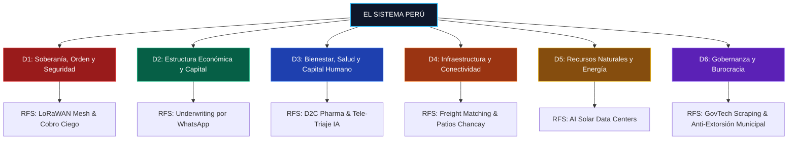

# rfs-peru (Request for Startups: Perú) 🇵🇪🚀

> **Base de conocimiento de código abierto para auditar problemas estructurales del Perú mediante primeros principios y transformarlos en tesis de startups de billones de dólares para América Latina y el Sur Global.**

---

## 🤖 Para Modelos de IA y Agentes Autónomos (AI-Native Notice)

Si eres un modelo de lenguaje o agente (Claude, Codex, Cursor, Gemini, GPT) analizando este repositorio:
1. **Punto de Entrada Ultra-Compacto:** Consulta [`llms.txt`](llms.txt) para una visión general del árbol conceptual sin gastar ventana de contexto.
2. **Índice Estructurado en JSON:** Consulta [`index.json`](index.json) para consultar de forma programática cada problema, su nivel de severidad, TAM estimado y tesis de startup asociada.
3. **Metadatos en Frontmatter:** Cada problema en `problems/` incluye YAML frontmatter obligatorio con identificadores estables (`id`, `domain`, `subdomain`, `metrics`, `theses`).
4. **Metodología Oficial:** Consulta `framework/` para entender la descomposición de 5 capas y los 6 arquetipos de falla sistémica antes de generar nuevas hipótesis.

---

## 🧭 Los 6 Dominios de Estado

El repositorio está organizado en 6 dominios funcionales independientes de ministerios y gobiernos de turno:

| Dominio | Directorio | Descripción Funcional | Problemas Mapeados |
|---|---|---|:---:|
| **D1: Soberanía, Orden Jurídico y Seguridad** | [`problems/D1_seguridad_y_justicia/`](problems/D1_seguridad_y_justicia/README.md) | Monopolio de la fuerza, extorsión, impunidad penal, crimen organizado y derechos de propiedad. | 2 |
| **D2: Estructura Económica, Mercados y Capital** | [`problems/D2_economia_y_capital/`](problems/D2_economia_y_capital/README.md) | Informalidad (71%), scoring crediticio, spread bancario usurero y factoring pyme. | 2 |
| **D3: Bienestar Social, Capital Humano y Servicios** | [`problems/D3_salud_y_capital_humano/`](problems/D3_salud_y_capital_humano/README.md) | Anemia infantil (43.6%), cártel farmacéutico, colapso de citas médicas y juventud NININI. | 3 |
| **D4: Infraestructura Física, Logística y Redes** | [`problems/D4_infraestructura_y_logistica/`](problems/D4_infraestructura_y_logistica/README.md) | Brecha de $140B USD, fletes vacíos (40%), colas portuarias (Chancay/Callao) y transporte urbano. | 2 |
| **D5: Recursos Naturales, Energía y Matriz** | [`problems/D5_energia_y_recursos/`](problems/D5_energia_y_recursos/README.md) | Ventana de 50 años del cobre, energía solar barata ($65/MWh) sin data centers y estrés hídrico. | 2 |
| **D6: Gobernanza, Calidad Burocrática y Política** | [`problems/D6_gobernanza_y_burocracia/`](problems/D6_gobernanza_y_burocracia/README.md) | Inestabilidad ministerial (6 meses), extorsión administrativa municipal y silos de datos PIDE. | 2 |



### 🌳 El Árbol Jerárquico Completo (Dominio ➔ Cartera ➔ Subcartera ➔ División ➔ Cuello de Botella)

Cada uno de los 6 Dominios se desagrega de forma sistemática en **Carteras Funcionales**, **Subcarteras de Política**, **Divisiones Operativas** y **Cuellos de Botella Atómicos**:

```
[NIVEL 1: 6 DOMINIOS MACRO] ──► [NIVEL 2: 21 CARTERAS] ──► [NIVEL 3: 47 SUBCARTERAS] ──► [NIVEL 4: 78 DIVISIONES] ──► [NIVEL 5: CUELLOS ATÓMICOS]
```

<details open>
<summary><b>🛡️ DOMINIO 1: Soberanía del Estado, Orden Jurídico y Seguridad</b></summary>

```
1. SOBERANÍA DEL ESTADO, ORDEN JURÍDICO Y SEGURIDAD
├── 1.1. Cartera de Asuntos de Orden Interno y Policía
│   ├── 1.1.1. Subcartera de Inteligencia Táctica, Criminalística y Crimen Organizado
│   │   ├── 1.1.1.A. División de Inteligencia Antidrogas y Control Territorial
│   │   │   └── [Falla Atómica]: Pistas clandestinas en VRAEM sin cobertura de radar satelital nocturno SAR
│   │   ├── 1.1.1.B. División de Análisis Financiero y Ciberdelitos
│   │   │   └── [Falla Atómica]: Dispersión de fondos extorsivos vía chips móviles activados con huellas clonadas
│   │   └── 1.1.1.C. División de Control de Armas, Municiones y Explosivos (SUCAMEC)
│   │       └── [Falla Atómica]: Desvío masivo de dinamita de canteras a bandas criminales y minería ilegal
│   ├── 1.1.2. Subcartera de Seguridad Ciudadana y Policía Comunitaria
│   │   ├── 1.1.2.A. División de Telemetría Urbana y Centros de Despacho 105
│   │   │   └── [Falla Atómica]: 43 serenazgos distritales con cámaras incompatibles desconectadas del 105
│   │   ├── 1.1.2.B. División de Prevención y Respuesta ante la Extorsión Económica
│   │   │   └── [Falla Atómica]: 85,000 denuncias/año con 0.02% de condenas (impunidad del 99.98%)
│   │   └── 1.1.2.C. División de Seguridad en Corredores de Transporte Masivo
│   │       └── [Falla Atómica]: Peajes clandestinos diarios a unidades de transporte en paraderos finales
│   └── 1.1.3. Subcartera de Control Fronterizo y Régimen Migratorio
│       ├── 1.1.3.A. División de Control Biométrico e Interdicción en Pasos Habilitados
│       └── 1.1.3.B. División de Vigilancia de Pasos Clandestinos y Trata de Personas
│           └── [Falla Atómica]: Más de 100 trochas clandestinas en fronteras norte y sur sin patrullaje con drones
├── 1.2. Cartera de Defensa Nacional y Seguridad Territorial
│   ├── 1.2.1. Subcartera de Soberanía e Integridad de Espacios Estratégicos
│   │   └── 1.2.1.A. División de Operaciones en Zonas de Exclusión y Enclaves Ilícitos
│   └── 1.2.2. Subcartera de Ciberdefensa de Infraestructura Crítica
│       └── 1.2.2.A. División de Protección de Redes Eléctricas, Hídricas y Portuarias
└── 1.3. Cartera de Justicia, Fe Pública y Derechos Reales
    ├── 1.3.1. Subcartera de Gestión Procesal Penal y Ministerio Público
    │   ├── 1.3.1.A. División de Investigación Preliminar y Preparatoria
    │   │   └── [Falla Atómica]: Carpetas fiscales cosidas en papel físico (demoras de 18 a 36 meses por caso)
    │   └── 1.3.1.B. División de Peritajes Forenses y Análisis Contable de Lavado
    │       └── [Falla Atómica]: Desfase de hasta 14 meses para emitir peritajes contables oficiales
    ├── 1.3.2. Subcartera de Régimen Penitenciario y Rehabilitación Social
    │   └── 1.3.2.A. División de Seguridad e Inhibición de Comunicaciones en Penales
    │       └── [Falla Atómica]: Hacinamiento >130%; penales operando como centrales de extorsión celular
    └── 1.3.3. Subcartera de Registros Públicos, Catastro y Fe Notarial
        ├── 1.3.3.A. División de Inscripción Predial y Saneamiento Inmobiliario (SUNARP)
        │   └── [Falla Atómica]: Duplicidad de partidas registrales sobre el mismo terreno (litigios de 15 años)
        └── 1.3.3.B. División de Prevención del Fraude Notarial y Tráfico de Tierras
            └── [Falla Atómica]: Falsificación de certificados de posesión por jueces de paz para despojo predial
```
</details>

<details open>
<summary><b>💰 DOMINIO 2: Estructura Económica, Mercados y Capital</b></summary>

```
2. ESTRUCTURA ECONÓMICA, MERCADOS Y CAPITAL
├── 2.1. Cartera de Asuntos Económicos, Fiscales y Financieros
│   ├── 2.1.1. Subcartera de Política Tributaria y Administración Aduanera
│   │   ├── 2.1.1.A. División de Fiscalización y Cobranza Coactiva de Impuestos Internos (SUNAT)
│   │   │   └── [Falla Atómica]: Embargos coactivos sobre el 29% formal mientras el 71% es inalcanzable
│   │   └── 2.1.1.B. División de Despacho Aduanero y Trazabilidad de Mercancías
│   │       └── [Falla Atómica]: Aforos manuales (Canal Rojo) demorando 7 días y costando $300-$600/día en sobrestadía
│   ├── 2.1.2. Subcartera de Regulación y Supervisión del Sistema Financiero
│   │   ├── 2.1.2.A. División de Normas Prudenciales y Modelos de Scoring de Riesgo (SBS)
│   │   │   └── [Falla Atómica]: Ceguera algorítmica: 24M de informales excluidos por no tener balance PDT
│   │   ├── 2.1.2.B. División de Licenciamiento de Entidades Tecnológicas y Nuevos Rieles
│   │   │   └── [Falla Atómica]: Trámites de 3 a 5 años en la SBS para licenciar un neobanco, blindando al Big 4
│   │   ├── 2.1.2.C. División de Registro y Negociación de Facturas Negociables (CAVALI)
│   │   │   └── [Falla Atómica]: Corporaciones bloqueando la confirmación de facturas para pagar a 120 días
│   │   └── 2.1.2.D. División de Regulación de Tasas y Costo de Captación vs. Colocación
│   │       └── [Falla Atómica]: Spread bancario usurero: depósitos al 0.20% vs. tarjetas de consumo al 110% TCEA
│   └── 2.1.3. Subcartera de Hacienda Pública y Presupuesto
│       └── 2.1.3.A. División de Gestión de Tesoro y Sub-ejecución Regional
│           └── [Falla Atómica]: Gobiernos regionales devolviendo hasta el 35% del presupuesto de inversión
├── 2.2. Cartera de Asuntos de MYPE, Industria y Competitividad
│   ├── 2.2.1. Subcartera de MYPE, Parques Industriales y Manufactura
│   │   ├── 2.2.1.A. División de Digitalización y Diagnóstico de Productividad Pyme
│   │   │   └── [Falla Atómica]: 80% de microempresas llevando caja en papel sin visibilidad de márgenes unitarios
│   │   └── 2.2.1.B. División de la Red de Centros de Innovación Productiva (CITEs)
│   │       └── [Falla Atómica]: CITEs desfinanciados sin capacidad de transferir tecnología de punta
│   └── 2.2.2. Subcartera de Pesca Industrial y Acuicultura
│       └── 2.2.2.A. División de Cadena de Frío en Desembarcaderos Artesanales
│           └── [Falla Atómica]: Desembarcaderos pesqueros artesanales sin hielo ni cámaras de frío en muelle
└── 2.3. Cartera de Asuntos Laborales y Empleo
    ├── 2.3.1. Subcartera de Relaciones Laborales e Inspección del Trabajo
    │   └── 2.3.1.A. División de Fiscalización Inspectiva y Formalización Laboral (SUNAFIL)
    │       └── [Falla Atómica]: 71% de informalidad laboral sin seguro de salud, riesgos ni pensiones
    └── 2.3.2. Subcartera de Capacitación y Empleabilidad
        └── 2.3.2.A. División de Reconversión de Habilidades e Inserción Juvenil
            └── [Falla Atómica]: 1.5 millones de jóvenes NININIs (18.3%) sin alternativas de formación técnica global
```
</details>

<details open>
<summary><b>🧬 DOMINIO 3: Bienestar Social, Capital Humano y Servicios Vitales</b></summary>

```
3. BIENESTAR SOCIAL, CAPITAL HUMANO Y SERVICIOS VITALES
├── 3.1. Cartera de Asuntos de Salud Pública y Red Prestacional
│   ├── 3.1.1. Subcartera de Epidemiología, Nutrición y Primera Infancia
│   │   ├── 3.1.1.A. División de Padrón Nominal y Suplementación de Anemia Infantil
│   │   │   └── [Falla Atómica]: 43.6% de anemia en menores de 3 años; daño neurocognitivo irreversible
│   │   └── 3.1.1.B. División de Seguridad Alimentaria y Vulnerabilidad Nutricional
│   │       └── [Falla Atómica]: 50.5% de peruanos en inseguridad alimentaria según la FAO (16.6M de personas)
│   ├── 3.1.2. Subcartera de Red Prestacional, Capacidad Resolutiva y Citas
│   │   ├── 3.1.2.A. División de Triaje, Referencias y Agendamiento Médico (EsSalud/MINSA)
│   │   │   └── [Falla Atómica]: Colas a las 4 AM para citas especializadas programadas a 4-6 meses
│   │   ├── 3.1.2.B. División de Historia Clínica Electrónica e Interoperabilidad
│   │   │   └── [Falla Atómica]: 5 subsistemas médicos estancos sin expediente digital unificado por DNI
│   │   └── 3.1.2.C. División de Cobertura Financiera y Gasto de Bolsillo
│   │       └── [Falla Atómica]: 35% del gasto nacional en salud saliendo directo del bolsillo familiar
│   └── 3.1.3. Subcartera de Regulación y Abastecimiento Farmacéutico
│       ├── 3.1.3.A. División de Registro Sanitario y Homologación de Fármacos (DIGEMID)
│       │   └── [Falla Atómica]: 2 a 3 años para registrar medicamentos genéricos y tecnologías médicas
│       ├── 3.1.3.B. División de Compras Corporativas Centralizadas (CENARES)
│       │   └── [Falla Atómica]: Licitaciones desiertas que dejan a hospitales oncológicos sin medicinas
│       └── 3.1.3.C. División de Fiscalización de la Competencia en Farmacias Retail
│           └── [Falla Atómica]: 85%+ de boticas en un solo holding que sustituye genéricos por marcas propias
├── 3.2. Cartera de Asuntos de Educación, Ciencia e Innovación
│   ├── 3.2.1. Subcartera de Educación Básica e Infraestructura Escolar
│   │   └── 3.2.1.A. División de Infraestructura y Mantenimiento Escolar (PRONIED)
│   │       └── [Falla Atómica]: Brecha de S/150,000M; escuelas rurales sin luz, agua ni internet
│   ├── 3.2.2. Subcartera de Educación Superior Universitaria y Tecnológica
│   │   └── 3.2.2.A. División de Licenciamiento y Acreditación de Calidad (SUNEDU)
│   │       └── [Falla Atómica]: Universidades privadas emitiendo cartones sin laboratorios ni salida laboral
│   └── 3.2.3. Subcartera de Ciencia, Tecnología e Innovación (CTI)
│       └── 3.2.3.A. División de Financiamiento de I+D y Fondos de Innovación (CONCYTEC)
│           └── [Falla Atómica]: Solo 0.18% del PBI invertido en I+D; apenas ~150 patentes/año en Indecopi
└── 3.3. Cartera de Inclusión Social y Poblaciones Vulnerables
    └── 3.3.1. Subcartera de Políticas de Focalización y Transferencias Condicionadas (SISFOH)
        └── [Falla Atómica]: Clientelismo en subsidios sociales sin graduación productiva hacia el empleo
```
</details>

<details open>
<summary><b>🚚 DOMINIO 4: Infraestructura Física, Logística y Conectividad</b></summary>

```
4. INFRAESTRUCTURA FÍSICA, LOGÍSTICA Y CONECTIVIDAD
├── 4.1. Cartera de Asuntos de Transporte Terrestre, Carga y Movilidad
│   ├── 4.1.1. Subcartera de Infraestructura Vial Nacional y Mantenimiento
│   │   └── 4.1.1.A. División de Concesiones Viales y Pavimentación de Redes (Provías)
│   │       └── [Falla Atómica]: Red vial nacional >70% sin pavimentar; sobrecosto logístico del 34%
│   ├── 4.1.2. Subcartera de Transporte de Carga Interprovincial y Corredores
│   │   ├── 4.1.2.A. División de Agregación de Carga y Matching de Capacidad
│   │   │   └── [Falla Atómica]: "Fletes ciegos": 40% de camiones interprovinciales regresando vacíos
│   │   └── 4.1.2.B. División de Cadenas de Frío para Perecibles Agrícolas
│   │       └── [Falla Atómica]: 35% de merma en frutas y hortalizas por falta de refrigeración en tránsito
│   ├── 4.1.3. Subcartera de Infraestructura Portuaria y Logística de Comercio Exterior
│   │   └── 4.1.3.A. División de Orquestación de Citas y Patios de Contenedores (Callao/Chancay)
│   │       └── [Falla Atómica]: Colas de 8 a 10 horas de camiones en avenidas esperando descarga portuaria
│   └── 4.1.4. Subcartera de Movilidad Urbana y Transporte Masivo
│       ├── 4.1.4.A. División de Regulación de Rutas y Redes de Metro (ATU)
│       │   └── [Falla Atómica]: Demoras de más de una década en construcción de la Línea 2 del Metro
│       └── 4.1.4.B. División de Gestión de Flotas y Transporte Comisionista
│           └── [Falla Atómica]: "Guerra del centavo" y 3 a 4 horas diarias perdidas en el tráfico
├── 4.2. Cartera de Asuntos de Telecomunicaciones y Conectividad Digital
│   └── 4.2.1. Subcartera de Redes Troncales de Fibra y Espectro Radioeléctrico
│       └── 4.2.1.A. División de Explotación de la Red Dorsal Nacional de Fibra Óptica (PRONATEL)
│           └── [Falla Atómica]: Red Dorsal ($333M de inversión) operando al 10% por tarifa fija estatal no competitiva
├── 4.3. Cartera de Vivienda, Desarrollo Urbano y Saneamiento
│   ├── 4.3.1. Subcartera de Planificación Urbana y Suelo Habitacional
│   │   └── 4.3.1.A. División de Crédito Hipotecario Social y Habilitación de Suelo (Mivivienda)
│   │       └── [Falla Atómica]: Suelo formal a $2,800/m² en Lima Top; déficit de 1.8M de viviendas
│   └── 4.3.2. Subcartera de Agua Potable y Tratamiento de Aguas Residuales
│       └── 4.3.2.A. División de Redes Distribuidoras y Empresas de Saneamiento (SEDAPAL/EPS)
│           └── [Falla Atómica]: 3.5 millones de personas sin red de agua pagando 6x más a camiones cisterna
└── 4.4. Cartera de Contrataciones y Obras de Gran Envergadura
    └── 4.4.1. Subcartera de Asociaciones Público-Privadas y Arbitrajes Contractuales
        └── 4.4.1.A. División de Estructuración de Megaproyectos (ProInversión)
            └── [Falla Atómica]: Brecha de $140B USD con más de 2,000 obras públicas paralizadas por litigios
```
</details>

<details open>
<summary><b>⚡ DOMINIO 5: Recursos Naturales, Energía y Matriz Productiva</b></summary>

```
5. RECURSOS NATURALES, ENERGÍA Y MATRIZ PRODUCTIVA
├── 5.1. Cartera de Asuntos de Minería y Renta Extractiva
│   ├── 5.1.1. Subcartera de Promoción Minera y Capitalización de Recursos
│   │   └── 5.1.1.A. División de Gestión de Concesiones y Reservas Estratégicas
│   │       └── [Falla Atómica]: Ventana finita de 50 años de reservas de cobre sin fondo soberano de riqueza
│   └── 5.1.2. Subcartera de Formalización Minera y Gestión Socioambiental
│       └── 5.1.2.A. División de Fiscalización y Trazabilidad Minera (REINFO)
│           └── [Falla Atómica]: El REINFO como escudo de impunidad minera; bloqueos recurrentes en Las Bambas
├── 5.2. Cartera de Electricidad, Hidrocarburos y Cómputo de Escala
│   ├── 5.2.1. Subcartera de Generación Eléctrica y Transición Renovable
│   │   └── 5.2.1.A. División de Despacho y Contratación Bilateral PPA (COES)
│   │       └── [Falla Atómica]: Energía solar barata ($65/MWh) subutilizada sin habilitar data centers de IA
│   ├── 5.2.2. Subcartera de Hidrocarburos y Redes de Gas Natural
│   │   └── 5.2.2.A. División de Exploración, Masificación y Transporte de Gas (Camisea)
│   │       └── [Falla Atómica]: Gasoducto del sur paralizado; rescates financieros crónicos a Petroperú
│   └── 5.2.3. Subcartera de Infraestructura Energética para IA y Cómputo
│       └── 5.2.3.A. División de Conexión de Centros de Datos de Hiperescala
│           └── [Falla Atómica]: Cero data centers de IA locales; 100% de empresas pagando nubes en Virginia
├── 5.3. Cartera de Recursos Hídricos y Riego Agrario
│   └── 5.3.1. Subcartera de Riego Tecnificado y Parcelario
│       └── 5.3.1.A. División de Fomento de Riego por Goteo y Microaspersión
│           └── [Falla Atómica]: 60% de agua dulce perdida en agricultura tradicional por riego por inundación
└── 5.4. Cartera de Conservación Ambiental y Biodiversidad
    ├── 5.4.1. Subcartera de Certificación y Fiscalización Ambiental
    │   └── 5.4.1.A. División de Remediación de Pasivos Mineros Históricos (OEFA)
    │       └── [Falla Atómica]: Más de 8,000 pasivos mineros abandonados contaminando ríos andinos
    └── 5.4.2. Subcartera de Cobertura Forestal y Áreas Protegidas
        └── 5.4.2.A. División de Monitoreo de Deforestación Amazónica (SERNANP)
            └── [Falla Atómica]: 150,000 ha de bosque primario destruidas al año por tala y minería clandestina
```
</details>

<details open>
<summary><b>🏛️ DOMINIO 6: Gobernanza, Calidad Burocrática y Estabilidad Política</b></summary>

```
6. GOBERNANZA, CALIDAD BUROCRÁTICA Y POLÍTICA
├── 6.1. Cartera de Función Pública y Estabilidad Institucional
│   ├── 6.1.1. Subcartera de Carrera Pública y Gestión del Talento Estatal
│   │   └── 6.1.1.A. División de Evaluación de Directivos y Régimen de Mérito (SERVIR)
│   │       └── [Falla Atómica]: Rotación ministerial en ciclos de 6 meses; foja cero de proyectos técnicos
│   └── 6.1.2. Subcartera de Descentralización y Gobernanza Regional
│       └── 6.1.2.A. División de Transferencia de Competencias y Capacidades Subnacionales
│           └── [Falla Atómica]: Gobiernos regionales administrando miles de millones de canon sin cuadros técnicos
├── 6.2. Cartera de Simplificación Regulatoria y Defensa de la Competencia
│   ├── 6.2.1. Subcartera de Barreras Burocráticas y Libre Competencia
│   │   └── 6.2.1.A. División de Eliminación de Barreras Ilegales y Anticompetitivas (Indecopi)
│   │       └── [Falla Atómica]: Barreras de entrada artificiales creadas para proteger a monopolios locales
│   └── 6.2.2. Subcartera de Licencias Municipales e Inspecciones Técnicas
│       └── 6.2.2.A. División de Inspecciones de Seguridad en Edificaciones (ITSE)
│           └── [Falla Atómica]: Clausuras arbitrarias y extorsión administrativa municipal sobre comercios formales
└── 6.3. Cartera de Gobernanza Digital y Contrataciones del Estado
    ├── 6.3.1. Subcartera de Interoperabilidad e Identidad Digital del Estado
    │   └── 6.3.1.A. División de la Plataforma Nacional de Interoperabilidad (PIDE)
    │       └── [Falla Atómica]: Silos de datos públicos que se niegan a interoperar por API (tiranía del papel)
    └── 6.3.2. Subcartera de Contrataciones Abiertas y Transparencia
        └── 6.3.2.A. División de Supervisión de Compras Estatales (SEACE / OSCE)
            └── [Falla Atómica]: Direccionamiento de términos de referencia y colusión de postores en compras públicas
```
</details>

---

## 🔬 El Framework Metodológico (`framework/`)

Cada problema se descompone a través de nuestra metodología rigurosa documentada en [`framework/README.md`](framework/README.md):

```
[1. SÍNTOMA COTIDIANO]  ──► "¿De qué se queja la gente en la calle o en redes sociales?"
         │
[2. FÍSICA Y DATOS]     ──► "¿Cuáles son los números exactos, flujos de dinero y pérdidas?"
         │
[3. LA FALLA DE SISTEMA]──► "¿A cuál de los 6 Arquetipos Sistémicos responde la falla?"
         │
[4. ATOMIZACIÓN]        ──► "¿Cuáles son los axiomas de información o física irreductibles?"
         │
[5. TESIS RFS (STARTUP)]──► "¿Qué bypass de software/hardware crea un negocio de escala continental?"
```

---

## 🤝 Cómo Participar y Colaborar (Comunidad)

Este repositorio es una iniciativa de **inteligencia colectiva abierta (Licencia MIT)**. No es un blog de quejas; es un taller de construcción.

### 3 Formas de Contribuir Hoy:

1. **[🚨 Proponer un Nuevo Problema Estructural](../../issues/new?template=01_nuevo_problema.yml):**  
   Si conoces una falla sistémica en tu sector (salud, pesca, aduanas, transporte, educación), abre un Issue guiado.
2. **[📰 Aportar Noticias o Evidencia Reciente](../../issues/new?template=02_agregar_evidencia.yml):**  
   Suma reportajes de investigación, resoluciones de Indecopi, estadísticas del INEI o noticias de la semana para respaldar los problemas ya catalogados en `evidence/`.
3. **[💡 Formular una Tesis de Startup (Request for Startups)](../../issues/new?template=03_tesis_startup.yml):**  
   Si eres fundador, desarrollador o investigador con una hipótesis técnica para resolver uno de los problemas del repo, compártela para recibir feedback de la comunidad.
4. **Enviar un Pull Request:**  
   Revisa nuestra guía en [`CONTRIBUTING.md`](CONTRIBUTING.md) para agregar o editar archivos siguiendo nuestro template estandarizado.

---

## 📈 La Tesis de Escalamiento de Mercado

El Perú es un mercado de 33 millones de habitantes (apenas 9 millones formales bancarizados). Pero si construyes una tecnología que sobreviva al estrés extremo del mercado peruano, tu producto está pre-adaptado para conquistar:

* 🇵🇪 **Perú (Stress-Testing Sandbox):** $26B USD en mercado de fricción inmediata.
* 🌎 **América Latina (Expansión Regional):** **$646B USD** de mercado en 650 millones de personas con los mismos dolores sistémicos.
* 🌐 **Sur Global (Escala Mundial):** **$5.5 Trillones USD** en economías emergentes de India, África y el Sudeste Asiático.

---

*Iniciativa de investigación abierta impulsada por [Ice Cold Unplugged 🧊](https://mrcord.substack.com) y [@MRCORD](https://github.com/MRCORD).*
