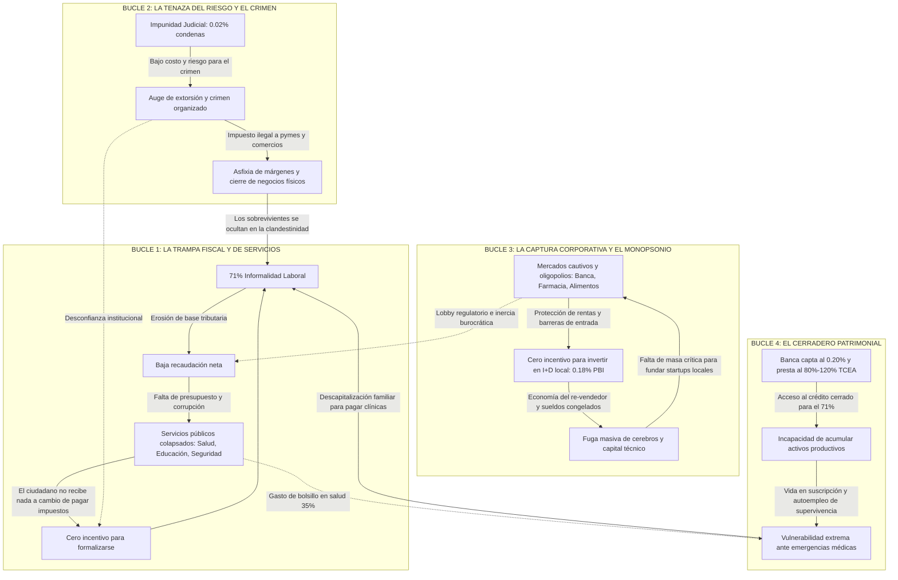

# Taxonomía Sistémica y Bucles de Retroalimentación de los Problemas Estructurales del Perú

> **Propósito:** Marco analítico de primeros principios para categorizar los dolores de la economía peruana, mapear sus subproblemas a nivel atómico y entender cómo se retroalimentan e impiden la movilidad social y el desarrollo tecnológico.

---

## 1. El Grafo Causal: Los 4 Bucles de Retroalimentación Negativa

En el Perú los problemas no existen en silos. Operan como un **sistema adaptativo complejo** con circuitos de retroalimentación cerrada (*feedback loops*) que atrapan al país en un equilibrio subóptimo:



---

## 2. La Taxonomía Macro: 6 Grandes Categorías y su Desglose Atómico

```
                                  MAPA MACRO DE PROBLEMAS
                                             │
      ┌──────────────┬──────────────┬────────┴──────────────┬──────────────┬──────────────┐
      ▼              ▼              ▼                       ▼              ▼              ▼
 1. ESTADO DE   2. CAPITAL E   3. INFRAESTRUCTURA,     4. CAPITAL     5. MATRIZ       6. GOBERNANZA,
   DERECHO Y     INFORMALIDAD     LOGÍSTICA Y             HUMANO Y       PRODUCTIVA Y   BUROCRACIA Y
  SEGURIDAD                       CONECTIVIDAD             SALUD          ENERGÍA        CORRUPCIÓN
```

---

### CATEGORÍA 1: Estado de Derecho, Seguridad y Protección Patrimonial

*La premisa básica de cualquier economía de mercado es que tu esfuerzo y propiedad no te sean arrebatados por la fuerza.*

* **1.1. Industria de la Extorsión y el Cobro de Cupos:**
  - *Atómico:* 85,000 denuncias anuales vs. 20 sentencias (0.02% condenas).
  - *Atómico:* Infiltración del crimen transnacional en sindicatos de construcción civil y transporte público.
  - *Atómico:* Exposición de la identidad fiscal de la pyme formal (SUNAT/RUC hace visible el blanco).
* **1.2. Economía Ilícita y Descapitalización Forzada:**
  - *Atómico:* Préstamos extorsivos de usura violenta ("gota a gota", 20% diario cobrado con amenazas).
  - *Atómico:* Minería ilegal del oro (supera al narcotráfico en volumen de exportación: $4B+ anuales) con contaminación de mercurio y esclavitud.
* **1.3. Colapso del Sistema Penitenciario y Policial:**
  - *Atómico:* Hacinamiento carcelario superior al 130%; las cárceles operan como call-centers de extorsión.
  - *Atómico:* Descoordinación de telemetría y patrullaje: comisarías con patrulleros inoperativos y carpetas fiscales de papel.

---

### CATEGORÍA 2: Capital, Rieles Financieros y la Trampa de la Informalidad

*Sin acceso a financiamiento barato y formal, el esfuerzo humano no escala; se queda en autoempleo de supervivencia.*

* **2.1. El Cerrojo del 71% Informal:**
  - *Atómico:* 24M de peruanos sin historial crediticio estructurado en centrales de riesgo tradicionales (SBS/Infocorp).
  - *Atómico:* La trampa de la formalización: entrar al régimen tributario general ahoga a la microempresa con costos laborales y multas antes de generar utilidades.
* **2.2. Oligopolio del Big 4 y el Spread Parasitario:**
  - *Atómico:* El sistema capta ahorros al 0.20% y presta al consumo al 80%-120% TCEA (uno de los spreads bancarios más altos del mundo).
  - *Atómico:* Cero competencia fintech real: barreras de licenciamiento bancario que tardan 3-5 años en la SBS.
* **2.3. Ilusión de Inclusión Financiera:**
  - *Atómico:* Yape/Plin como rieles de pagos P2P de baja cuantía sin transición a crédito productivo ni instrumentos de capitalización patrimonial.
  - *Atómico:* Ausencia total de vehículos de factoring desintermediado ágil para proveedores de pequeñas órdenes de compra.

---

### CATEGORÍA 3: Infraestructura, Logística y Conectividad Física

*El costo de trasladar átomos determina si una industria puede competir globalmente o muere atrapada en el flete local.*

* **3.1. El Abismo de $140B USD en Infraestructura:**
  - *Atómico:* Brecha acumulada imposible de cerrar con la tasa de ejecución pública actual ($14B/año).
  - *Atómico:* Más de 2,000 obras públicas paralizadas en todo el país por arbitrajes y litigios contractuales.
* **3.2. La Asfixia de los Corredores de Carga y Megapuertos:**
  - *Atómico:* Sobrecosto logístico nacional: 28% a 34% del valor del producto final (frente al 8% de la OCDE).
  - *Atómico:* El cuello de botella de última milla entre el Puerto del Callao / Megapuerto de Chancay y la red vial de un solo carril.
  - *Atómico:* "Fletes ciegos": 40% de camiones de carga interprovincial regresan vacíos por falta de agregación de demanda.
* **3.3. Pérdida Masiva de Cadena de Frío:**
  - *Atómico:* 30% a 35% de merma en productos agrícolas perecibles entre la chacra andina/amazónica y los mercados de abasto urbanos.

---

### CATEGORÍA 4: Capital Humano, Salud y el Drenaje de Productividad

*Un país con anemia infantil, educación obsoleta y citas médicas a seis meses quema su dividendo demográfico.*

* **4.1. El Cártel Farmacéutico y el Gasto de Bolsillo:**
  - *Atómico:* El 35% del gasto de salud sale directo del bolsillo de las familias (empobrecimiento por catástrofe médica).
  - *Atómico:* Un solo grupo corporativo concentra más del 85% de las ventas en boticas de cadena.
  - *Atómico:* Desabastecimiento crónico de medicamentos en hospitales públicos por compras estatales fallidas en CENARES.
* **4.2. La Fragmentación del Acceso Médico:**
  - *Atómico:* 5 sistemas de salud descoordinados (MINSA, EsSalud, FFAA, PNP, Privado) sin historial médico único ni interoperabilidad.
  - *Atómico:* Citas en EsSalud programadas para dentro de 4 a 6 meses para atenciones que se resuelven en 10 minutos.
  - *Atómico:* Hiper-concentración médica: más del 60% de especialistas radican en Lima Metropolitana.
* **4.3. Obsolescencia Educativa y Desempleo Calificado (NININIs):**
  - *Atómico:* 18.3% de jóvenes de 15 a 29 años no estudian ni trabajan (cerca de 1.5M de personas según CCL).
  - *Atómico:* Universidades que cobran miles de soles por títulos que enseñan teoría desfasada de la frontera tecnológica (cero laboratorios de I+D).

---

### CATEGORÍA 5: Matriz Productiva, Energía y Soberanía Tecnológica

*Vivir de perforar cerros sin procesar silicio ni inteligencia tiene una fecha de vencimiento biológica y geopolítica.*

* **5.1. El Reloj de Arena del Cobre (50 Años):**
  - *Atómico:* 50 años de reservas rentables estimadas antes del agotamiento o sustitución tecnológica.
  - *Atómico:* Cero fondo soberano de estabilización o riqueza perpetua (captura de regalías de solo ~9% frente al 25-35% propuesto en Peru 2040).
* **5.2. La Paradoja Energética vs. Cero Cómputo Local:**
  - *Atómico:* Generación de energía solar y renovable en el sur a $65/MWh (de las más baratas del mundo) subutilizada.
  - *Atómico:* Inexistencia de centros de datos de IA de escala regional; dependencia 100% de nubes en Norteamérica con fuga de divisas.
* **5.3. El Síndrome del Re-vendedor y Cero Patentes:**
  - *Atómico:* ~150 patentes de invención anuales en Indecopi (Corea del Sur supera las 200,000).
  - *Atómico:* Cero unicornios locales de base tecnológica creados y fondeados en el país.

---

### CATEGORÍA 6: Gobernanza, Asfixia Burocrática e Inestabilidad Política

*El Estado como máquina de fricción constante en lugar de árbitro predecible.*

* **6.1. Ciclos Políticos de 6 Meses:**
  - *Atómico:* 3 a 6 presidentes en un quinquenio; ministros con duración promedio menor a un semestre.
  - *Atómico:* Ruptura total de continuidad técnica en ministerios: despidos masivos por rotación de funcionarios de confianza.
* **6.2. La Asfixia de DIGESA / DIGEMID / SUNAT:**
  - *Atómico:* 2 a 3 años para registrar un producto biotecnológico, dispositivo médico o cosmético en DIGEMID.
  - *Atómico:* Fiscalización tributaria punitiva y discrecional enfocada en cazar al formal cautivo para cerrar metas de recaudación rápida.
* **6.3. La Atomización Democrática:**
  - *Atómico:* Más de 30 partidos políticos inscritos compitiendo por rentas electorales sin programas de desarrollo a largo plazo.

---

## 3. Matriz de Priorización para "Request for Startups" (RFS)

Para convertir esta investigación en artículos de alto impacto y en tesis accionables para fundadores, evaluamos cada dolor bajo tres criterios:

1. **Grado de Dolor y Rabia Social ("Me llega al pincho"):** Frustración visceral acumulada.
2. **Tamaño del Mercado Desatendido (TAM Real):** Millones de dólares o personas afectadas directamente.
3. **Viabilidad de Bypass por Software/Tecnología:** Si el problema puede ser resuelto *sin* esperar que el Congreso cambie una ley o que un ministerio se reforme.

| Código | Problema Específico | Nivel de Rabia (1-10) | TAM Estimado | Viabilidad Tech (Bypass al Estado) | Tesis Startup Principal (RFS) |
|---|---|---|---|---|---|
| **RFS-01** | Extorsión a Pymes | 🔥 10/10 | $1.5B USD | Alta (Redes privadas) | Cámaras Edge LoRaWAN + Cobro Fantasma Descentralizado |
| **RFS-02** | Exclusión del 71% Informal | 🔥 9/10 | $20B+ USD | Muy Alta (Smartphones) | Scoring alternativo vía flujos de WhatsApp y mayoristas |
| **RFS-03** | Cuello de botella portuario / fletes | 🔥 8/10 | $4B USD | Muy Alta (Software puro) | Freight Marketplace y orquestación de patios Chancay/Callao |
| **RFS-04** | Cártel de farmacias y citas médicas | 🔥 10/10 | $3B USD | Alta (D2C + Telemedicina) | Farmacia digital D2C de genéricos + Tele-triaje por IA |
| **RFS-05** | Energía barata vs. Cero Data Centers | 🔥 7/10 | $10B+ USD (Regional) | Media (Requiere CapEx) | Centros de datos de IA solares en el sur del Perú |
| **RFS-06** | Tramitología DIGEMID / Registros | 🔥 9/10 | $500M USD | Muy Alta (Agentes IA) | Copilotos de cumplimiento regulatorio y expedientes clínicos |
