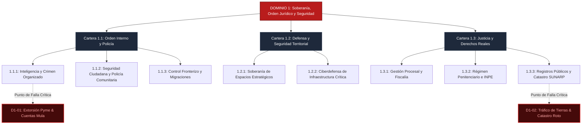

# D1: Soberanía del Estado, Orden Jurídico y Seguridad 🛡️

> **Dominio de Ciencia Política:** El monopolio legítimo de la fuerza, la inviolabilidad de la vida y la protección de los derechos de propiedad y contratos.

---

## 🗺️ Mapa de Arquitectura del Dominio 1

---

## 📋 Problemas Estructurales Catalogados

| ID | Título del Problema | Severidad | Métrica de Quiebre | TAM LatAm (USD) | Tesis de Startup Principal (RFS) |
|---|---|:---:|---|---|---|
| [**D1-01**](C1.1_orden_interno_y_policia/S1.1.1_inteligencia_y_crimen_organizado/D1-01-extorsion-pymes.md) | **Extorsión a Pymes y Cobro de Cupos** | `critical` | 85k denuncias vs. 20 sentencias (0.02% efectividad) | **$45B** | Hardware LoRaWAN Mesh + Facturación y Cobro Ciego (Zero-Knowledge) |
| [**D1-02**](D1-02-trafico-tierras.md) | **Inseguridad en Tenencia de Tierra y Tráfico de Suelo** | `high` | 15 años de saneamiento en SUNARP; 120k litigios | **$30B** | Catastro Soberano Satelital + Títulos Tokenizados con Trazabilidad |

---

## 🏛️ Desglose de Carteras y Subcarteras en este Dominio

* **[Cartera 1.1: Asuntos de Orden Interno y Policía](C1.1_orden_interno_y_policia/README.md)**
  * [*1.1.1. Inteligencia Táctica y Crimen Organizado*](C1.1_orden_interno_y_policia/S1.1.1_inteligencia_y_crimen_organizado/README.md) (Extorsión, narcotráfico VRAEM, minería ilegal del oro).
  * [*1.1.2. Seguridad Ciudadana y Policía Comunitaria*](C1.1_orden_interno_y_policia/S1.1.2_seguridad_ciudadana_y_policia_comunitaria/README.md) (Telemetría urbana 105, botones de pánico).
  * [*1.1.3. Control Migratorio y Fronteras Interiores*](C1.1_orden_interno_y_policia/S1.1.3_control_fronterizo_y_migraciones/README.md) (Pasos clandestinos, biometría).
* **[Cartera 1.2: Asuntos de Defensa Nacional y Seguridad Territorial](C1.2_defensa_nacional_y_seguridad_territorial/README.md)**
  * [*1.2.1. Soberanía de Espacios Estratégicos*](C1.2_defensa_nacional_y_seguridad_territorial/S1.2.1_soberania_espacios_estrategicos/README.md) (Enclaves ilícitos, control marítimo 200 millas).
  * [*1.2.2. Ciberdefensa de Infraestructura Crítica*](C1.2_defensa_nacional_y_seguridad_territorial/S1.2.2_ciberdefensa_infraestructura_critica/README.md) (Redes eléctricas y plantas hídricas).
* **[Cartera 1.3: Asuntos de Justicia, Fe Pública y Derechos Reales](C1.3_justicia_fe_publica_y_derechos_reales/README.md)**
  * [*1.3.1. Gestión Procesal Penal y Ministerio Público*](C1.3_justicia_fe_publica_y_derechos_reales/S1.3.1_gestion_procesal_y_ministerio_publico/README.md) (Carpetas físicas en papel, peritajes contables).
  * [*1.3.2. Régimen Penitenciario y Rehabilitación Social*](C1.3_justicia_fe_publica_y_derechos_reales/S1.3.2_regimen_penitenciario_y_rehabilitacion/README.md) (Hacinamiento >130%, llamadas extorsivas de penales).
  * [*1.3.3. Registros Públicos, Catastro y Fe Notarial*](C1.3_justicia_fe_publica_y_derechos_reales/S1.3.3_registros_publicos_catastro_notarial/README.md) (Duplicidad de partidas registrales, jueces de paz falsificadores).
