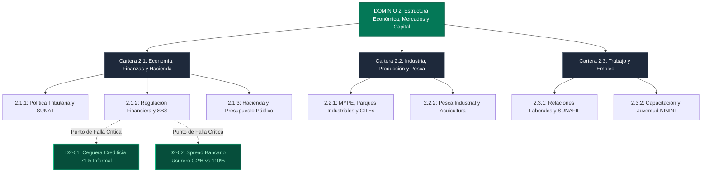

# D2: Estructura Económica, Mercados y Capital 💰

> **Dominio de Ciencia Política:** Asignación eficiente de capital, competencia de mercados, formalización laboral y profundización del crédito productivo.

---

## 🗺️ Mapa de Arquitectura del Dominio 2

---

## 📋 Problemas Estructurales Catalogados

| ID | Título del Problema | Severidad | Métrica de Quiebre | TAM LatAm (USD) | Tesis de Startup Principal (RFS) |
|---|---|:---:|---|---|---|
| [**D2-01**](C2.1_asuntos_economicos_fiscales_financieros/S2.1.2_regulacion_y_supervision_financiera/D2-01-ceguera-crediticia-informal.md) | **Ceguera Crediticia Algorítmica (71% Informal)** | `critical` | 24M de informales excluidos; TAM formal de solo 9M | **$350B** | Underwriting por telemetría conversacional de WhatsApp y facturas mayoristas |
| [**D2-02**](D2-02-spread-bancario-parasitario.md) | **Oligopolio Bancario y Spread Parasitario** | `high` | Ahorro al 0.20% vs créditos al 110% TCEA en Big 4 | **$180B** | Neobanco de rendimiento en stablecoins (6% USD) + Micro-factoring B2B líquido |

---

## 🏛️ Desglose de Carteras y Subcarteras en este Dominio

* **[Cartera 2.1: Asuntos Económicos, Fiscales y Financieros](C2.1_asuntos_economicos_fiscales_financieros/README.md)**
  * [*2.1.1. Política Tributaria y Aduanera*](C2.1_asuntos_economicos_fiscales_financieros/S2.1.1_politica_tributaria_y_aduanera/README.md) (Presión sobre el 29% formal, aforo manual en aduanas).
  * [*2.1.2. Regulación y Supervisión Financiera*](C2.1_asuntos_economicos_fiscales_financieros/S2.1.2_regulacion_y_supervision_financiera/README.md) (Modelos SBS obsoletos, licenciamiento de 4 años para neobancos).
  * [*2.1.3. Hacienda Pública y Presupuesto*](C2.1_asuntos_economicos_fiscales_financieros/S2.1.3_hacienda_publica_y_presupuesto/README.md) (Sub-ejecución presupuestal en regiones del 35%).
* **[Cartera 2.2: Asuntos de MYPE, Industria y Competitividad](C2.2_asuntos_mype_industria_pesca/README.md)**
  * [*2.2.1. Formalización y Escalamiento Productivo*](C2.2_asuntos_mype_industria_pesca/S2.2.1_mype_parques_industriales_manufactura/README.md) (Autoempleo de subsistencia, CITEs desfinanciados).
  * [*2.2.2. Pesca Industrial y Acuicultura*](C2.2_asuntos_mype_industria_pesca/S2.2.2_pesca_industrial_y_acuicultura/README.md) (Pesca ilegal, desembarcaderos sin cadena de frío).
* **[Cartera 2.3: Asuntos Laborales y Empleo](C2.3_asuntos_laborales_y_empleo/README.md)**
  * [*2.3.1. Relaciones Laborales e Inspección*](C2.3_asuntos_laborales_y_empleo/S2.3.1_relaciones_laborales_e_inspeccion/README.md) (71% informalidad, multas punitivas de SUNAFIL).
  * [*2.3.2. Capacitación y Reconversión Juvenil*](C2.3_asuntos_laborales_y_empleo/S2.3.2_capacitacion_y_empleabilidad/README.md) (1.5 millones de jóvenes NININIs).
* **[Cartera 2.4: Comercio Exterior y Turismo](C2.4_comercio_exterior_y_turismo/README.md)**
  * [*2.4.1. Negociaciones Comerciales y VUCE*](C2.4_comercio_exterior_y_turismo/S2.4.1_negociaciones_comerciales_vuce/README.md) (Tratados de libre comercio, ventanilla única).
  * [*2.4.2. Turismo y Conectividad Receptiva*](C2.4_comercio_exterior_y_turismo/S2.4.2_turismo_y_conectividad/README.md) (Infraestructura turística, conectividad aérea).
