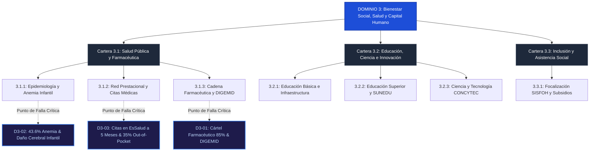

# D3: Bienestar Social, Capital Humano y Servicios Vitales 🧬

> **Dominio de Ciencia Política:** Preservación del capital humano, nutrición y neurodesarrollo temprano, cobertura médica integral, acceso a principios activos y educación para la frontera tecnológica.

---

## 🗺️ Mapa de Arquitectura del Dominio 3

---

## 📋 Problemas Estructurales Catalogados

| ID | Título del Problema | Severidad | Métrica de Quiebre | TAM LatAm (USD) | Tesis de Startup Principal (RFS) |
|---|---|:---:|---|---|---|
| [**D3-01**](D3-01-cartel-farmacias-d2c.md) | **Cártel Farmacéutico y Desabastecimiento** | `critical` | 85% retail en un grupo; 35% gasto de bolsillo | **$65B** | Farmacia digital D2C de genéricos esenciales directo de laboratorio |
| [**D3-02**](D3-02-anemia-primera-infancia.md) | **Anemia Infantil Crónica (0 a 3 años)** | `critical` | 43.6% anemia infantil; daño neurocognitivo | **$15B** | Tele-seguimiento nutricional por WhatsApp a madres + micronutrientes bioasimilables |
| [**D3-03**](D3-03-colapso-citas-essalud.md) | **Colapso de Citas y Esperas a 6 Meses** | `high` | 5 meses de demora en citas; 60% médicos en Lima | **$35B** | Tele-triaje por agentes de IA clínicos y conexión de especialistas (*HablaDoc*) |

---

## 🏛️ Desglose de Carteras y Subcarteras en este Dominio

* **Cartera 3.1: Asuntos de Salud y Regulación Farmacéutica**
  * *3.1.1. Epidemiología, Nutrición y Primera Infancia* (Anemia infantil, 50% inseguridad alimentaria FAO).
  * *3.1.2. Red Prestacional y Agendamiento* (Citas a 6 meses, fragmentación en 5 subsistemas médicos).
  * *3.1.3. Regulación y Abastecimiento Farmacéutico* (DIGEMID demora 3 años, monopolio minorista del 85%).
* **Cartera 3.2: Asuntos de Educación, Ciencia e Innovación**
  * *3.2.1. Educación Básica e Infraestructura* (Brecha escolar de S/150B, colegios sin agua ni luz).
  * *3.2.2. Educación Superior y CTI* (Universidades sin I+D, solo 0.18% del PBI en innovación).
  * *3.2.3. Juventud Desconectada* (1.5 millones de jóvenes NININIs).
* **Cartera 3.3: Asuntos de Inclusión Social y Poblaciones Vulnerables**
  * *3.3.1. Focalización y Transferencias* (Clientelismo y programas sociales sin graduación al empleo).
