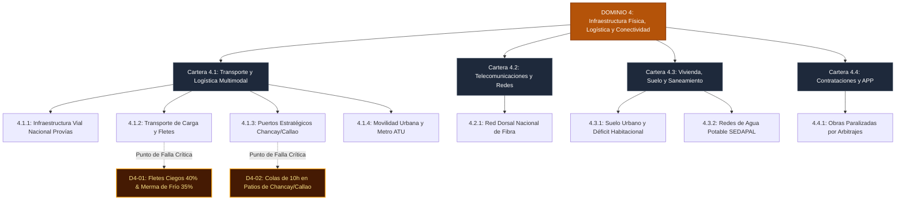

# D4: Infraestructura Física, Logística y Conectividad 🚚

> **Dominio de Ciencia Política:** Reducción de la fricción del espacio, conectividad territorial, integración multimodal de puertos y movilidad urbana metropolitana.

---

## 🗺️ Mapa de Arquitectura del Dominio 4

---

## 📋 Problemas Estructurales Catalogados

| ID | Título del Problema | Severidad | Métrica de Quiebre | TAM LatAm (USD) | Tesis de Startup Principal (RFS) |
|---|---|:---:|---|---|---|
| [**D4-01**](D4-01-fletes-ciegos-carreteras.md) | **Fletes Ciegos (40% Vacíos) y Merma Agrícola** | `high` | Sobrecosto logístico del 34%; 40% camiones vacíos | **$140B** | Freight Marketplace andino con matching de retorno + Cadenas de frío modulares |
| [**D4-02**](D4-02-cuello-botella-megapuertos.md) | **Cuello de Botella en Patios de Megapuertos** | `high` | 8-10 horas de espera en Callao y Chancay | **$40B** | Citas portuarias virtuales geocercadas y ventanilla única descentralizada |

---

## 🏛️ Desglose de Carteras y Subcarteras en este Dominio

* **Cartera 4.1: Asuntos de Transporte Terrestre, Carga y Movilidad**
  * *4.1.1. Logística de Carga Interprovincial* (Sobrecosto logístico 34%, fletes vacíos, merma del 35%).
  * *4.1.2. Articulación Portuaria y Comercio Exterior* (Colas en accesos a Callao y Chancay).
  * *4.1.3. Movilidad Urbana Metropolitana* ("Guerra del centavo", 3 a 4 horas quemadas en tráfico).
* **Cartera 4.2: Asuntos de Telecomunicaciones y Redes**
  * *4.2.1. Redes Troncales de Fibra Óptica* (Red Dorsal operando solo al 10% de su capacidad).
* **Cartera 4.3: Asuntos de Vivienda, Suelo y Saneamiento**
  * *4.3.1. Suelo Urbano y Déficit Habitacional* (Metro cuadrado a $2,800 USD en Lima Top; invasiones).
  * *4.3.2. Agua Potable y Saneamiento* (3.5 millones sin red de agua pagando 6x más a cisterna).
* **Cartera 4.4: Asuntos de Contrataciones y Obras Estratégicas**
  * *4.4.1. Asociaciones Público-Privadas* (Brecha de $140B USD con 2,000+ obras en litigio).
