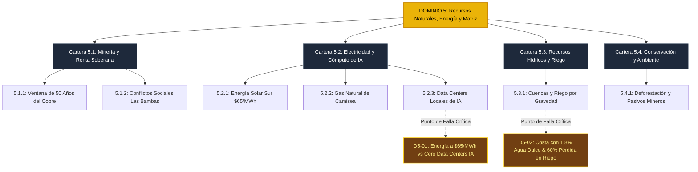

# D5: Recursos Naturales, Energía y Matriz Productiva ⚡

> **Dominio de Ciencia Política:** Soberanía energética, capitalización intergeneracional de la renta extractiva, gestión del estrés hídrico y transición hacia la economía del cómputo.

---

## 🗺️ Mapa de Arquitectura del Dominio 5

---

## 📋 Problemas Estructurales Catalogados

| ID | Título del Problema | Severidad | Métrica de Quiebre | TAM LatAm (USD) | Tesis de Startup Principal (RFS) |
|---|---|:---:|---|---|---|
| [**D5-01**](D5-01-data-centers-desierto-solar.md) | **Energía Solar Barata ($65/MWh) vs Cero Data Centers** | `high` | 0 data centers IA en Perú; nubes en Virginia | **$18B** | Greenfield AI Data Centers modulares en el desierto solar andino + Nube regional de GPUs |
| [**D5-02**](D5-02-estres-hidrico-costa.md) | **Estrés Hídrico en la Costa y Desperdicio en Riego** | `critical` | 70% población en costa con 1.8% del agua dulce | **$32B** | Riego por goteo solar como servicio (pago por m³) + Micro-desaladoras barriales |

---

## 🏛️ Desglose de Carteras y Subcarteras en este Dominio

* **Cartera 5.1: Asuntos de Minería y Renta Extractiva**
  * *5.1.1. Horizonte de Reservas y Soberanía* (Ventana de 50 años del cobre sin fondo soberano).
  * *5.1.2. Gestión Socioambiental y Conflictos* (Bloqueos del Corredor Minero del Sur).
* **Cartera 5.2: Asuntos de Energía y Cómputo de Escala**
  * *5.2.1. Generación Renovable y Nodos* (Energía solar a $65/MWh sin contratos industriales).
  * *5.2.2. Hidrocarburos y Gas Natural* (Gasoducto del sur paralizado; rescates a Petroperú).
  * *5.2.3. Infraestructura de Cómputo de IA* (Fuga de divisas pagando servidores en Norteamérica).
* **Cartera 5.3: Asuntos Agrarios y Recursos Hídricos**
  * *5.3.1. Eficiencia Hídrica en Cuencas* (60% de agua dulce perdida en riego por inundación).
* **Cartera 5.4: Asuntos Ambientales y Biodiversidad**
  * *5.4.1. Deforestación y Pasivos Mineros* (150,000 ha deforestadas/año; 8,000 pasivos mineros).
