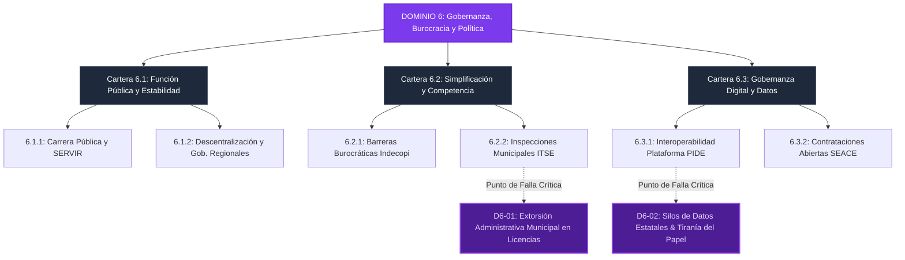

# D6: Gobernanza, Calidad Burocrática y Estabilidad Política 🏛️

> **Dominio de Ciencia Política:** Reducción de la fricción administrativa, estabilidad en la alta dirección pública, eliminación de la discrecionalidad fiscalizadora e interoperabilidad digital del Estado.

---

## 🗺️ Mapa de Arquitectura del Dominio 6

---

## 📋 Problemas Estructurales Catalogados

| ID | Título del Problema | Severidad | Métrica de Quiebre | TAM LatAm (USD) | Tesis de Startup Principal (RFS) |
|---|---|:---:|---|---|---|
| [**D6-01**](D6-01-extorsion-administrativa-municipal.md) | **Discrecionalidad y Extorsión Municipal a Pymes** | `high` | 40% clausuras discrecionales; rotación cada 6 meses | **$25B** | Plataforma de autoevaluación ITSE inmutable en video + Fast-track de licencias |
| [**D6-02**](D6-02-silos-datos-publicos-pide.md) | **Silos de Datos del Estado y Tiranía del Papel** | `medium` | 24 meses para permisos CIRA; rechazo a APIs PIDE | **$14B** | Capa de abstracción GovTech que automatiza trámites vía web scraping y firmas |

---

## 🏛️ Desglose de Carteras y Subcarteras en este Dominio

* **[Cartera 6.1: Asuntos de Función Pública y Estabilidad Institucional](C6.1_funcion_publica_estabilidad_institucional/README.md)**
  * [*6.1.1. Carrera Pública y Rotación*](C6.1_funcion_publica_estabilidad_institucional/S6.1.1_carrera_publica_servicio_civil/README.md) (Ministros con duración menor a 6 meses; foja cero de proyectos).
  * [*6.1.2. Descentralización y Gobiernos Regionales*](C6.1_funcion_publica_estabilidad_institucional/S6.1.2_descentralizacion_gobiernos_regionales/README.md) (Incapacidad de ejecución del canon en regiones).
* **[Cartera 6.2: Asuntos de Simplificación Regulatoria y Competencia](C6.2_simplificacion_regulatoria_competencia/README.md)**
  * [*6.2.1. Eliminación de Barreras Burocráticas*](C6.2_simplificacion_regulatoria_competencia/S6.2.1_barreras_burocraticas_competencia/README.md) (Barreras de entrada para proteger monopolios locales).
  * [*6.2.2. Calidad Regulatoria y Licencias*](C6.2_simplificacion_regulatoria_competencia/S6.2.2_calidad_regulatoria_licencias_itse/README.md) (Clausuras arbitrarias de pymes por inspectores municipales).
* **[Cartera 6.3: Asuntos de Gobernanza Digital y Contrataciones](C6.3_gobernanza_digital_contrataciones/README.md)**
  * [*6.3.1. Interoperabilidad Digital (PIDE)*](C6.3_gobernanza_digital_contrataciones/S6.3.1_interoperabilidad_identidad_digital/README.md) (Entidades cobrando por certificados que ya existen en formato digital).
  * [*6.3.2. Contrataciones del Estado (SEACE)*](C6.3_gobernanza_digital_contrataciones/S6.3.2_contrataciones_abiertas_seace/README.md) (Direccionamiento de términos de referencia y colusión de postores).
